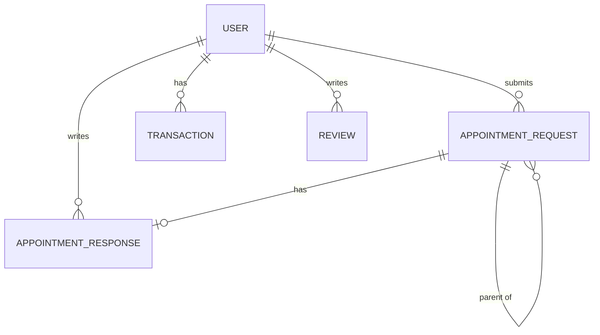

# Database Schema — AppointMedi

## Entity Relationship Diagram

---

## Models

### USER
**App:** `apps.users` — extends `AbstractBaseUser` + `PermissionsMixin`  
**Manager:** custom `UserManager` (email-based, no username)  
**Role:** `is_staff=False` → Patient · `is_staff=True` → Admin  
**Login field:** `email` (`USERNAME_FIELD = 'email'`, `REQUIRED_FIELDS = []`)

| Field | Type | Notes |
|---|---|---|
| `email` | EmailField | unique, login identifier |
| `full_name` | CharField(255) | blank |
| `balance` | DecimalField(10,2) | default=0 |
| `phone` | CharField(17) | blank, regex: `^\+?1?\d{9,15}$` |
| `bio` | TextField | blank |
| `photo` | CloudinaryField | null, blank |
| `is_staff` | BooleanField | default=False |
| `is_active` | BooleanField | default=True |
| `is_superuser` | BooleanField | from PermissionsMixin |
| `created_at` | DateTimeField | auto_now_add |
| `updated_at` | DateTimeField | auto_now |

**Properties:** `is_admin` → returns `is_staff` · `is_patient` → returns `not is_staff`

> `AUTH_USER_MODEL = 'users.User'` must be set before any migration.  
> No `username` field. `__str__` returns `email`.

---

### APPOINTMENT_REQUEST
**App:** `apps.appointments`

| Field | Type | Notes |
|---|---|---|
| `id` | AutoField | PK |
| `patient` | ForeignKey → USER | CASCADE, limit to is_staff=False |
| `parent_request` | ForeignKey → self | SET_NULL, null, blank |
| `description` | TextField | free-form patient input |
| `status` | CharField(20) | default=PENDING, see below |
| `claimed_by` | ForeignKey → USER | SET_NULL, null, blank, limit to is_staff=True |
| `created_at` | DateTimeField | auto_now_add |
| `updated_at` | DateTimeField | auto_now |

**Indexes:** `patient`, `status`

**Status reference**

| Value | Meaning |
|---|---|
| PENDING | Submitted, awaiting admin |
| PROCESSING | Admin claimed, patient locked |
| INCOMPLETE | Admin requested more info |
| RESPONDED | Admin sent full response |
| CONFIRMED | Patient accepted |
| REJECTED | Patient declined |
| COMPLETED | Admin marked done |
| CANCELLED | Patient cancelled before response |

**Status transitions**

| From | Action | To | Actor |
|---|---|---|---|
| PENDING | claim | PROCESSING | Admin |
| PROCESSING | respond | RESPONDED | Admin |
| PROCESSING | request_incomplete | INCOMPLETE | Admin |
| INCOMPLETE | edit description | PENDING | Patient (auto) |
| RESPONDED | confirm | CONFIRMED | Patient |
| RESPONDED | reject | REJECTED | Patient |
| CONFIRMED | complete | COMPLETED | Admin |
| PENDING / INCOMPLETE | cancel | CANCELLED | Patient |
| COMPLETED | follow_up | new PENDING | Patient |

> Patient may edit `description` only at PENDING or INCOMPLETE.  
> Editing while INCOMPLETE auto-reverts status to PENDING.  
> `update_count` field was removed from the model. `claimed_by` field was added.

---

### APPOINTMENT_RESPONSE
**App:** `apps.appointments`  
Created and updated only via `AppointmentRequest` action methods.

| Field | Type | Notes |
|---|---|---|
| `id` | AutoField | PK |
| `request` | OneToOneField → APPOINTMENT_REQUEST | CASCADE |
| `admin` | ForeignKey → USER | SET_NULL, null, limit to is_staff=True |
| `description` | TextField | admin message to patient |
| `created_at` | DateTimeField | auto_now_add |
| `updated_at` | DateTimeField | auto_now |

---

### TRANSACTION
**App:** `apps.payments` — immutable, no `updated_at`

| Field | Type | Notes |
|---|---|---|
| `id` | AutoField | PK |
| `user` | ForeignKey → USER | CASCADE |
| `amount` | DecimalField(10,2) | positive for DEPOSIT, negative for DEDUCT |
| `type` | CharField(10) | DEPOSIT (deposit or refund) or DEDUCT (charged) |
| `transaction_id` | UUIDField | default=uuid4, unique, not editable |
| `gateway_ref` | CharField(100) | blank, SSLCommerz val_id from callback |
| `status` | CharField(10) | default=PENDING · SUCCESS · FAILED |
| `created_at` | DateTimeField | auto_now_add |

> `transaction_id` is generated by the backend and sent to SSLCommerz as `tran_id`.  
> `gateway_ref` is populated on the SSLCommerz callback.

**Indexes:** `user`, `status`

---

### REVIEW
**App:** `apps.users` — platform-level, not linked to a specific appointment

| Field | Type | Notes |
|---|---|---|
| `id` | AutoField | PK |
| `user` | ForeignKey → USER | CASCADE |
| `rating` | IntegerField | min=1, max=5, validated in serializer |
| `comment` | TextField | blank |
| `created_at` | DateTimeField | auto_now_add |
| `updated_at` | DateTimeField | auto_now |

**Constraint:** `UniqueConstraint(fields=['user'], name='one_review_per_user')`
